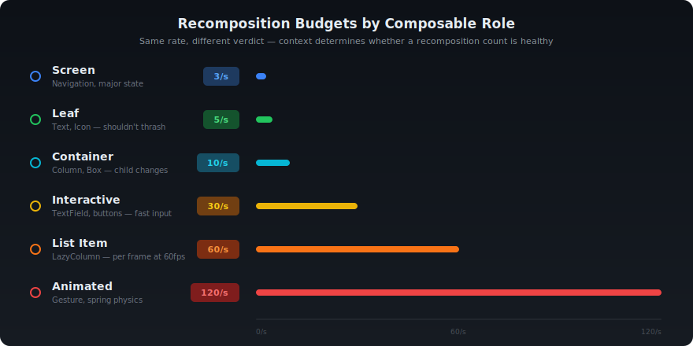
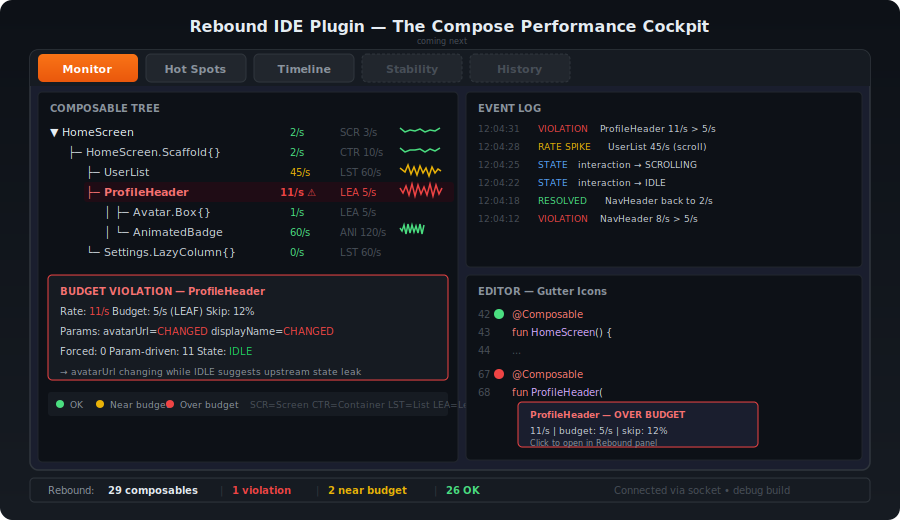

# Rebound

[](LICENSE)
[](https://kotlinlang.org)
[](https://developer.android.com)
[](https://developer.apple.com)
[](https://developer.android.com/jetpack/compose)
[](https://plugins.gradle.org)
[](https://plugins.jetbrains.com)

**Compose recomposition budget monitor** — catch runaway recompositions before they ship.

Rebound is a Kotlin compiler plugin that instruments every `@Composable` function with lightweight tracking calls. At runtime, it monitors recomposition rates against per-composable budgets, detects violations, and reports them via an Android Studio tool window, CLI, or logcat. Works on Android and iOS (Compose Multiplatform). Zero config required — just apply the Gradle plugin. The IDE plugin provides a 5-tab performance cockpit with live monitoring, hot spots ranking, timeline heatmap, stability analysis, and session history with VCS correlation.

## Features

- **Budget classes** — auto-classifies composables (Screen, Container, Interactive, List Item, Animated, Leaf) with appropriate rate budgets
- **Violation detection** — alerts when a composable exceeds its budget, with throttled logging to avoid noise
- **Call-tree hierarchy** — tracks parent-child composition relationships
- **Skip tracking** — monitors skip rate to identify composables that recompose without actual changes
- **Forced vs param-driven** — distinguishes parent-forced recompositions from parameter-change-driven ones
- **Dynamic budget scaling** — multiplies budgets during scrolling (2x), animation (1.5x), and user input (1.5x)
- **`@ReboundBudget` annotation** — override the inferred budget class for any composable
- **Baseline regression detection** — snapshot metrics before/after and compare for regressions
- **IDE tool window** — 5-tab performance cockpit (Monitor, Hot Spots, Timeline, Stability, History) with editor integration (gutter icons, CodeVision inlays, status bar widget) and session persistence
- **CLI** — `snapshot`, `summary`, `watch`, `ping` commands over ADB socket

## Quick Start

**1. Apply the Gradle plugin**

```kotlin
// settings.gradle.kts
pluginManagement {
    repositories {
        gradlePluginPortal()
        mavenCentral()
    }
}
```

```kotlin
// build.gradle.kts (app module)
plugins {
    id("io.github.aldefy.rebound") version "0.1.0"
}
```

**2. Configure (optional)**

```kotlin
rebound {
    enabled.set(true)    // default: true
    debugOnly.set(true)  // default: true — only instruments debug builds
}
```

**3. Run your app**

Rebound auto-installs on first composition. Violations appear in logcat:

```
W/Rebound: [VIOLATION] MyScreen — 8 recomp/s (budget: 3, class: SCREEN)
```

Connect the IDE plugin or CLI for richer output.

## Architecture


The compiler plugin injects `ReboundTracker.onCompositionEnter/Exit` calls into every `@Composable` function at the IR level. The runtime tracks rates per sliding window and reports violations. The IDE plugin and CLI connect via `LocalServerSocket("rebound")` forwarded through ADB (Android) or via a WebSocket relay (iOS physical devices).

> **Platform support:** The compiler plugin instruments all KMP targets. Android uses `LocalServerSocket` + ADB forward. iOS simulator uses a direct TCP server on `:18462`. iOS physical devices connect outbound to a Mac-side WebSocket relay via Bonjour auto-discovery, with console logging as fallback.

## Modules

| Module | Description |
|--------|-------------|
| `rebound-runtime` | KMP runtime library (Android, iOS, JVM). Full transport on all platforms. |
| `rebound-compiler` | Kotlin compiler plugin for Kotlin 2.0.x-2.1.x |
| `rebound-compiler-k2` | Kotlin compiler plugin for Kotlin 2.2+ |
| `rebound-gradle` | Gradle plugin — auto-wires compiler + runtime, selects correct artifact |
| `rebound-ide` | Android Studio plugin — 5-tab performance cockpit with editor integration |
| `tools/rebound-relay` | Mac relay server — bridges iOS physical devices to CLI/IDE via WebSocket |
| `sample` | Sample Android app |

## Configuration

```kotlin
rebound {
    enabled.set(true)    // Master switch — set false to disable all instrumentation
    debugOnly.set(true)  // Only instrument debug builds (release builds get no overhead)
}
```

Runtime toggles:

```kotlin
ReboundTracker.enabled = true            // Master on/off at runtime
ReboundTracker.logCompositions = false   // Per-composition logcat (throttled 1/s per composable)
```

## Budget Classes



Each composable is auto-classified by IR heuristics:

| Budget Class | Rate/sec | Heuristic |
|-------------|----------|-----------|
| `SCREEN` | 3 | Name contains `Screen` or `Page` |
| `CONTAINER` | 10 | Has child `@Composable` calls |
| `INTERACTIVE` | 30 | Default for unclassified |
| `LIST_ITEM` | 60 | Inside `LazyColumn`/`LazyRow`/`LazyGrid` |
| `ANIMATED` | 120 | Calls `animate*`/`Transition`/`Animation` APIs |
| `LEAF` | 5 | No child `@Composable` calls |

### Detailed Legend

#### SCREEN (3/s)

- **What:** Full-screen composables — the root of navigation destinations.
- **Heuristic:** Name contains `Screen` or `Page`.
- **Why 3/s:** Screens should only recompose on navigation events or major state changes. If a screen recomposes more than 3 times per second, state is leaking upward.
- **Example violation:** Reading a frequently-changing state (e.g., scroll position, animation progress) at screen level instead of hoisting it down.
- **Fix:** Hoist the changing state to the child that needs it. Use `derivedStateOf` or move reads into a smaller scope.

#### CONTAINER (10/s)

- **What:** Layout composables with child `@Composable` calls — Column, Row, Box, Scaffold content slots.
- **Heuristic:** Has child `@Composable` calls in its body.
- **Why 10/s:** Containers recompose when children's layout changes. Moderate rate expected, but sustained high rates indicate unnecessary invalidation.
- **Example:** A Column that recomposes because a child's size changed or an unstable lambda is being passed.

#### INTERACTIVE (30/s)

- **What:** Composables responding to user input — buttons, text fields, sliders.
- **Heuristic:** Default for unclassified composables.
- **Why 30/s:** Users type and tap fast. Input-driven composables need headroom for responsive UX.

#### LIST_ITEM (60/s)

- **What:** Items inside LazyColumn, LazyRow, LazyGrid.
- **Heuristic:** Inside a lazy layout scope.
- **Why 60/s:** During fast scroll, items are recycled at up to 60fps. One recomposition per frame is expected.

#### ANIMATED (120/s)

- **What:** Composables driven by animation APIs.
- **Heuristic:** Calls `animate*`, `Transition`, `Animation`, or `Animatable` APIs.
- **Why 120/s:** Animations target 60-120fps. This budget gives room for the animation to run without false alarms.

#### LEAF (5/s)

- **What:** Terminal composables with no child `@Composable` calls — `Text()`, `Icon()`, `Image()`.
- **Heuristic:** No child `@Composable` calls in the function body.
- **Why 5/s:** Individually cheap but shouldn't thrash. If a leaf recomposes >5/s, something upstream is pushing unnecessary state changes.

### Color Coding

| Color | Condition | Status |
|-------|-----------|--------|
| Red | rate > budget | OVER |
| Yellow | rate > 70% of budget | NEAR |
| Green | rate <= 70% of budget | OK |
| Gray | not actively recomposing | — |

### Dynamic Scaling

| Interaction State | Multiplier | Effect |
|---|---|---|
| IDLE | 1x | Normal budgets |
| SCROLLING | 2x | Budgets doubled during scroll |
| ANIMATING | 1.5x | Budgets increased during animation |
| USER_INPUT | 1.5x | Budgets increased during input |

### Override with @ReboundBudget

```kotlin
// This composable uses tilt sensor — it's not a leaf, it's animated
@ReboundBudget(BudgetClass.ANIMATED)
@Composable
fun TiltDrivenSticker(offset: Offset) { ... }
```

## IDE Plugin



The Android Studio plugin (targets 2024.2.1.3+) provides a 5-tab performance cockpit, editor integration, and session persistence. Configure via Preferences > Tools > Rebound.

### Tabs

**Monitor** — Live composable tree with sparkline rate history per node. Scrolling event log at the bottom shows recomposition events, violations, and state changes in real time.

**Hot Spots** — Sortable flat table of all tracked composables, ranked by severity (OVER > NEAR > OK). Summary card at the top shows violation/warning/OK counts at a glance. Click any row to jump to source.

**Timeline** — Composable x time heatmap. Each cell is colored green/yellow/red based on budget status at that moment. Scroll back up to 60 minutes. Useful for correlating recomposition spikes with user interactions.

**Stability** — Parameter stability matrix showing SAME/DIFFERENT/STATIC/UNCERTAIN status per parameter for each composable. Cascade impact tree visualizes how unstable parameters propagate recompositions through the hierarchy.

**History** — Saved sessions stored in `.rebound/sessions/`. Each session is VCS-tagged with branch name and commit hash. Side-by-side comparison view for before/after regression analysis.

### Editor Integration

- **Gutter icons** — Red, yellow, or green dots next to `@Composable` function declarations, reflecting live budget status.
- **CodeVision** — Inline hints above each composable function: `> 12/s | budget: 8/s | OVER | skip: 45%`.
- **Status bar** — Persistent widget at the bottom of the IDE: `Rebound: 45 composables | 3 violations`.

### Connection

The plugin connects via `adb forward tcp:18462 localabstract:rebound`. Install from the `rebound-ide` build output.

## CLI

The CLI auto-detects the connection path: direct TCP (iOS simulator or relay), ADB forward (Android), or devicectl console (iOS physical without relay).

```bash
./rebound-cli.sh snapshot   # Full JSON metrics for all tracked composables
./rebound-cli.sh summary    # Top 10 composables by recomposition rate
./rebound-cli.sh watch      # Live updates every 1 second
./rebound-cli.sh ping       # Health check → "pong"
```

Or query directly:

```bash
echo "snapshot" | nc localhost 18462
```

### iOS Physical Device Setup

For iOS physical devices, the runtime connects outbound to a Mac-side relay via WebSocket. The device discovers the relay automatically via Bonjour.

```bash
# Build the relay (one-time)
./tools/build-relay.sh

# Start the relay on your Mac
./tools/rebound-relay
# → TCP :18462 (CLI/IDE), WebSocket :18463 (devices), Bonjour: _rebound._tcp

# Now run your app on the physical device (same WiFi network)
# The device auto-discovers the relay and connects
./rebound-cli.sh snapshot   # works transparently through relay
```

Override Bonjour discovery with an env var if needed (e.g., different subnet):
```
REBOUND_RELAY_HOST=192.168.1.100:18463
```

## Kotlin Compatibility

| Kotlin Version | Compiler Artifact | Status |
|---------------|-------------------|--------|
| 2.0.x | `rebound-compiler` | Stable |
| 2.1.x | `rebound-compiler` | Stable |
| 2.2.x | `rebound-compiler-kotlin-2.2` | Stable |
| 2.3.x | `rebound-compiler-kotlin-2.3` | Stable |

The Gradle plugin auto-detects your project's Kotlin version and selects the correct compiler artifact. No manual configuration needed.

## Platform Support

| Platform | Transport | Status |
|----------|-----------|--------|
| Android (device/emulator) | `LocalServerSocket` + ADB forward | Stable |
| iOS Simulator | Direct TCP on `:18462` | Stable |
| iOS Physical Device | WebSocket → Mac relay (Bonjour auto-discovery) | Stable |
| iOS Physical Device (no relay) | Console logging via `devicectl` | Stable (one-way) |
| JVM/Desktop | In-memory (no transport) | Metrics collected, no export |

**Why multiple artifacts?** Kotlin's compiler plugin IR API changes between minor versions. Each artifact is compiled against the matching `kotlin-compiler-embeddable` to ensure binary compatibility.

## Roadmap

See [roadmap.md](roadmap.md) for the full iOS roadmap.

- [x] **iOS transport** — TCP server (simulator) + WebSocket relay (physical device) + console fallback
- [ ] CI budget gates — fail builds when recomposition budgets regress
- [ ] Flame chart mode in Timeline tab
- [ ] JetBrains Marketplace publication
- [ ] Session export/import for team sharing
- [ ] Baseline snapshots for regression testing
- [ ] ComposeProof integration for LLM-driven analysis
- [ ] DNS resolution for relay host override
- [ ] Multi-device relay routing

## AI Agent Skill

Make your AI coding tool understand Compose recomposition performance. The **[rebound-skill](https://github.com/aldefy/rebound-skill)** repo contains markdown-based instructions that any AI assistant can consume.

**What it covers:** Budget classes, violation diagnosis, skip rate analysis, stability optimization, CLI usage, IDE plugin workflow — all backed by the actual Rebound codebase.

**Supports:** Claude Code, Gemini CLI, Gemini (Android Studio), Cursor, Copilot, Codex, Windsurf, Amazon Q, and any markdown-consuming AI tool.

See [aldefy/rebound-skill](https://github.com/aldefy/rebound-skill) for setup instructions.

## Documentation

Full documentation at [aldefy.github.io/compose-rebound](https://aldefy.github.io/compose-rebound/).

## Contributing

```bash
# Build all modules
./gradlew build

# Build IDE plugin
./gradlew :rebound-ide:buildPlugin
# Output: rebound-ide/build/distributions/rebound-ide-0.1.0.zip

# Run sample app
./gradlew :sample:installDebug
```

## License

```
Copyright 2025 Adit Lal

Licensed under the Apache License, Version 2.0 (the "License");
you may not use this file except in compliance with the License.
You may obtain a copy of the License at

    http://www.apache.org/licenses/LICENSE-2.0

Unless required by applicable law or agreed to in writing, software
distributed under the License is distributed on an "AS IS" BASIS,
WITHOUT WARRANTIES OR CONDITIONS OF ANY KIND, either express or implied.
See the License for the specific language governing permissions and
limitations under the License.
```
