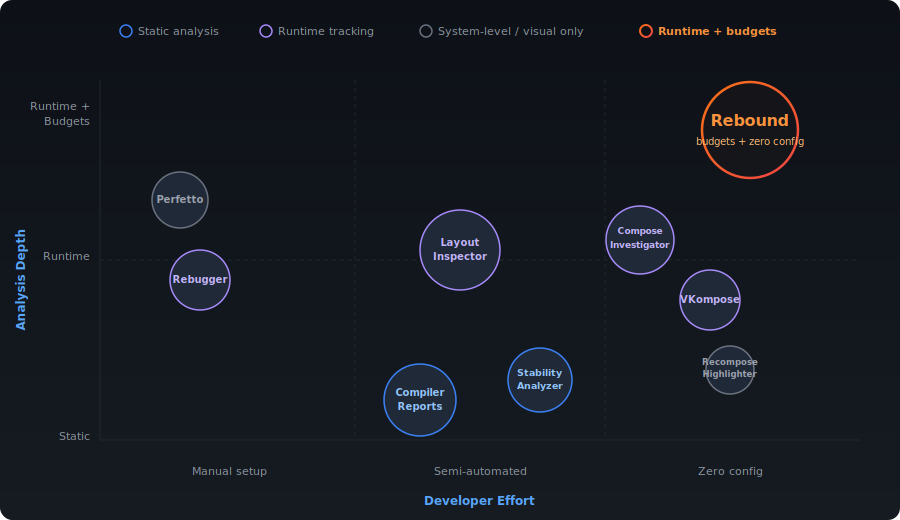
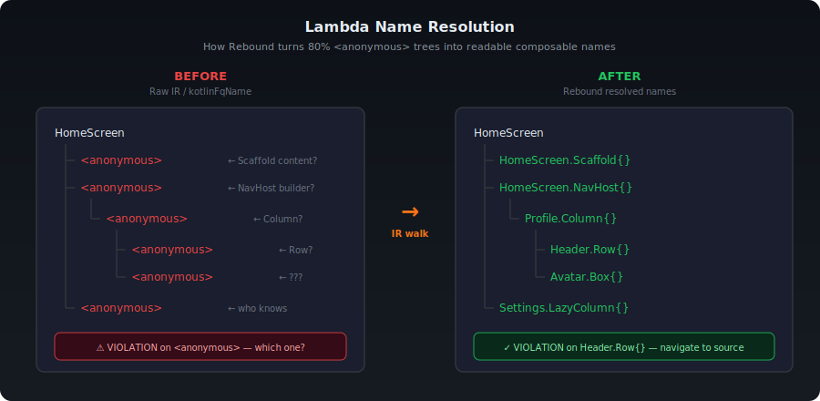
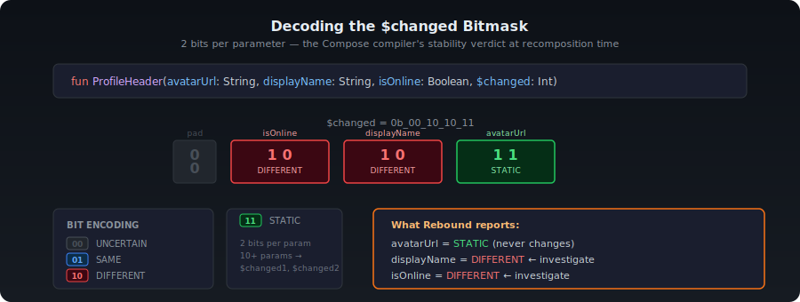
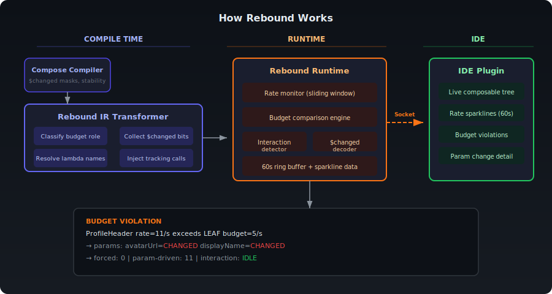

A `HomeScreen` recomposing 10 times per second is a problem. A composable driven by gesture physics recomposing 10 times per second is fine. Same number. Completely different situation.

The Compose ecosystem has solid tooling for tracking recompositions. Layout Inspector shows counts and skip rates. Compiler reports surface stability issues. Rebugger logs argument changes. ComposeInvestigator traces recomposition causes automatically. VKompose highlights hot composables with colored borders. Each of these tools answers an important question well.

But there's one question none of them answer:

**"Is this composable recomposing too much *for what it does*?"**

That's the question I built Rebound to answer.

<!-- truncate -->

## What already exists

Here's the current landscape. Each tool answers a different question -- and leaves a different gap:



**"Can this composable be skipped?"** -- Compose Compiler Reports tell you which classes are stable or unstable and which composables are skippable. Pure static analysis. Indispensable for understanding your architecture, but it won't tell you what actually recomposes at runtime or how often.

**"How many times did this recompose?"** -- Layout Inspector shows recomposition counts and skip counts per composable. Since compose-ui 1.10.0, it even tracks which state reads triggered recomposition. But a count of 847 means nothing without context. Is this composable animated? Is it a screen root? The number alone doesn't answer that.

**"What argument changed?"** -- Rebugger logs exactly which arguments changed, with before/after values. You wire up a `trackMap` per composable. Precise but manual -- it doesn't scale past a handful of composables.

**"Why did this recompose?"** -- ComposeInvestigator traces recomposition causes automatically through compiler instrumentation. Shows argument diffs and state modifications without manual setup. Tells you the *why*, but not whether the rate is healthy.

**"Which composables are hot right now?"** -- VKompose highlights recomposed functions with colored borders and logs reasons automatically at compile time. It also checks skippability. Excellent for visual diagnostics during development, but it's visualization, not rate-based analysis.

**"Is the main thread janking?"** -- Perfetto Tracing gives you the full rendering pipeline: main thread, GPU, frame timing. The right tool for deep profiling sessions. Too heavy for the question "is this composable recomposing more than it should?"

Every one of these tools is worth using. I use most of them. But the question they leave unanswered is: *"Given what this composable does, is this rate acceptable?"*

## From principles to practice

The Compose team's guidance is principle-based: minimize unnecessary recompositions, use stable types, hoist state. This is the right approach. Ben Trengrove's [articles on stability](https://medium.com/androiddevelopers/jetpack-compose-stability-explained-79c10db270c8) and [debugging recomposition](https://medium.com/androiddevelopers/jetpack-compose-debugging-recomposition-bfcf4a6f8d37), Leland Richardson's deep dives into the compiler and runtime -- they all reinforce the same idea: make parameters stable and the compiler handles the rest. `@Stable`, `@Immutable`, compiler reports, Strong Skipping Mode (default since Kotlin 2.0.20) -- the framework gives you the tools to get structural correctness right.

Where it gets harder is triage. Your types are stable, compiler metrics look clean, but a screen still janks. Layout Inspector shows a recomposition count of 847 on a composable. Is that a lot? Depends entirely on what that composable does -- and nothing in the current tooling connects the count to the context.

The natural instinct is to set a flat threshold. Pick a number -- say 10 recompositions per second -- and flag anything above it. I've tried this. It falls apart fast:

- An animated composable at 12/s gets flagged. It shouldn't.
- A screen composable at 8/s passes. It shouldn't.
- A list item at 40/s during fast scroll looks alarming. That's expected.

You either raise the threshold until the false positives go away (and miss real issues) or lower it until real issues surface (and drown in noise). Any single number you pick is wrong for most of your composables.

## Budget depends on what the composable does

A screen composable has a different recomposition budget than an animation-driven one. A leaf `Text()` with no children has a different budget than a `LazyColumn` recycling items during scroll. This seems obvious in hindsight.


Match the budget to the role and the useful warnings stop hiding behind false ones.

## What I actually found

I tested this on an app with draggable elements, physics animations, and sensor-driven UI. 29 composables instrumented, zero config.

A gesture-driven composable at 13/s? ANIMATED budget is 120/s. Fine. A flat threshold of 10 would've flagged this on every drag.

A `remember`-based state holder at 11/s? LEAF budget is 5/s. Real violation. A sensor was pushing continuous updates into recompositions. Two-line fix: debounce the input. I would've missed this with flat thresholds because I was busy dismissing animation warnings.

The interaction context matters too. Rebound detects whether the app is in IDLE, SCROLLING, ANIMATING, or USER_INPUT state. A list item at 40/s during scroll is expected -- the same rate during idle is a problem. Same composable, same number, different verdict.

## Solving the `<anonymous>` problem

Compose uses lambdas everywhere. `Scaffold`, `NavHost`, `Column`, `Row`, `LazyColumn` -- all take lambdas. Every one of those lambdas is a `@Composable` function that gets instrumented. When you inspect the IR, you get back names like:

```
com.example.HomeScreen.<anonymous>
com.example.ComposableSingletons$MainActivityKt.lambda-3.<anonymous>
```

The tree is 80% `<anonymous>`. You're staring at a recomposition violation and you have no idea if it's the Scaffold content, the NavHost builder, or a Column's children.

Layout Inspector doesn't have this problem. It reads `sourceInformation()` strings from the slot table -- compact tags the Compose compiler injects into every composable call. The name is right there. Layout Inspector reads it. Nothing else does.

Rebound takes a different approach: resolve names at compile time in the IR transformer. When the transformer visits an anonymous composable lambda, it walks the function body, finds the first user-visible `@Composable` call that isn't a runtime internal, and uses that call's name as the key.



A lambda whose body calls `Scaffold(...)` becomes `HomeScreen.Scaffold{}`. A lambda that calls `Column(...)` becomes `ExerciseCard.Column{}`. The `{}` suffix distinguishes a content lambda from the composable function itself.

```kotlin
private fun resolveComposableKey(function: IrFunction): String {
    val raw = function.kotlinFqName.asString()
    if (!raw.contains("<anonymous>")) return raw

    val pkg = extractPackage(raw)
    val parentName = findEnclosingName(function)
    val primaryCall = findPrimaryComposableCall(function)

    if (primaryCall != null) {
        return "$pkg$parentName.$primaryCall{}"
    }
    // fallback to counter-based λN
    ...
}
```

So `com.example.HomeScreen.Scaffold{}` displays as `HomeScreen.Scaffold{}` in the tree instead of `<anonymous>`.

## Reading the `$changed` bitmask

The Compose compiler injects `$changed` parameters into every `@Composable` function. Each parameter gets 2 bits encoding its stability state.



Rebound collects these at compile time and decodes them at runtime: bits `01` mean SAME, `10` mean DIFFERENT, `11` mean STATIC, `00` mean UNCERTAIN. When a composable recomposes with a parameter marked DIFFERENT, you know exactly which argument the caller changed.

Rebound goes further -- it separates forced recompositions (parent invalidated) from parameter-driven ones. When a violation fires, you see both: which parameters changed *and* whether the recomposition was forced by a parent or triggered by the composable's own state.

## Introducing Rebound

Rebound is a Kotlin compiler plugin and an Android Studio plugin. Here's how the pieces connect:



The compiler plugin runs after the Compose compiler in the IR pipeline: it classifies each composable into a budget based on name patterns and call tree structure, resolves human-readable keys for anonymous lambdas, and injects tracking calls. At runtime, it monitors recomposition rates against those budgets. The IDE plugin connects over a socket -- not logcat -- so you get structured data instead of string-parsed log lines.

When something exceeds its budget:

```
BUDGET VIOLATION: ProfileHeader rate=11/s exceeds LEAF budget=5/s
  -> params: avatarUrl=CHANGED, displayName=CHANGED
  -> forced: 0 | param-driven: 11 | interaction: IDLE
```

The composable name. The rate. The budget. The parameters that changed. Whether it was forced by a parent or driven by its own state. What the user was doing at the time.

Zero config. Debug builds only, no overhead in release. Three lines in your build file. KMP -- Android, JVM, iOS, Wasm.

## The IDE plugin: a Compose performance cockpit

The first version of the IDE plugin was a tree with numbers. Useful, but you still had to do most of the interpretation yourself. v2 is a full performance cockpit.

<!-- GIF: 15-20s walkthrough -->
<!--  -->

**Monitor tab** -- The live composable tree, now with sparkline rate history per composable and a scrolling event log. Violations, rate spikes, state transitions -- all timestamped. This was the entire plugin before. Now it's tab 1.

<!--  -->

**Hot Spots tab** -- A flat, sortable table of every composable. Sort by rate, budget ratio, skip percentage. Summary card at the top: "3 violations | 12 near budget | 85 OK." Double-click any row and it jumps to the source file. Like a profiler's method list, but for recompositions.

<!--  -->

**Timeline tab** -- A composable-by-time heatmap. Green, yellow, red cells. Scroll back 60 minutes. You can see temporal patterns: "UserList was hot for 5 seconds during scroll, then calmed down." Helps separate one-off spikes from sustained problems.

<!--  -->

**Gutter icons** -- Red, yellow, green dots next to every `@Composable` function in the editor. Click for rate, budget, and skip percentage. No tool window switching needed. This is the single most impactful UX change -- the research on developer tooling is clear that context-switching between a profiler window and source code is where time goes to die.

<!--  -->

We had stable data in prod for months. Then a feature change made one of our lists unstable. We shipped it without catching it. Rebound would have caught it locally -- a gutter icon going from green to red the moment the change was made.

## What's next

**Inlay hints** -- `> 12/s | budget: 8/s | OVER` above each composable function, CodeLens-style. Always visible without hovering.

**Stability tab** -- Per-parameter stability matrix. Which param is STABLE, UNSTABLE, UNCERTAIN. Helps answer "which parameter should I stabilize?" without reading compiler reports.

**History tab** -- Compare sessions across git commits. "This commit caused `UserCard` to go from 3/s to 18/s." No other tool correlates code changes with runtime recomposition regressions. This is the one that could change how teams catch performance regressions before they ship.

**CI budget gates** -- Export recomposition profiles as JSON, compare across builds, fail the PR if budgets regress. Runtime recomposition budgets enforced in CI. Nobody does this yet.

## Try it

The repo is live: **[github.com/aldefy/compose-rebound](https://github.com/aldefy/compose-rebound)**. Add the Gradle plugin, build in debug, and see which of your composables are over budget. The budget numbers come from testing across several Compose apps -- if your app has different composition patterns and the defaults don't fit, open an issue. That's how the numbers get better.

---

*[@AditLal](https://twitter.com/AditLal) on X / [aldefy](https://github.com/aldefy) on GitHub*
